<div align="center">

# 🏛️ CivicLens

**Multimedia complaint management for citizens and authorities**

A C# Windows Forms desktop application backed by SQL Server. Citizens report civic issues with photos and videos, moderators assign them, and police and journalists follow them through to resolution.




</div>

> **This is version 1**, my first C# project. An improved version with per-complaint chat, a public newsfeed with comments, and more admin tooling is available as **[CivicLens 2.0](https://github.com/dnsakibss/CivicLens2.0)**.

---

## 📌 About

CivicLens connects citizens with the people who can act on their complaints. Everyone signs in with a role, and the dashboard shows only the actions that role needs:

| Role | What they do |
| --- | --- |
| **Citizen** | Submit complaints with media, track their own complaints, view the status timeline |
| **Moderator** | Review every complaint and assign it to a Police officer or a Journalist |
| **Police** | Work through assigned complaints and update their status |
| **Journalist** | Review assigned complaints and mark them as Covered |
| **Admin** | Approve new accounts, manage users and admins, and maintain categories and locations |

---

## ✨ Features

### 🔐 Accounts and security
- Login with username and password, with a **show password** toggle
- Login checks the account state and blocks removed, disabled, locked and **pending** accounts with a clear message
- **Sign up** for any role. New accounts start as `Pending` until an admin approves them, and duplicate usernames are rejected
- **Forgot password** flow that verifies identity details before allowing a reset
- Password rule: at least 8 characters and at least one number
- **View profile**, **edit profile** (asks for your current password to confirm) and **change password**

### 📝 Citizen
- **Submit Complaint** with title, description, category, priority (`Low`, `Normal`, `High`) and a cascading **District → City → Area** location picker
- Attach multiple **images and videos** (jpg, png, bmp, gif, mp4, mov, avi, mkv), choose a primary item and remove items
- Every new complaint starts as `New` and gets its first `StatusHistory` entry
- **My Complaints** grid with search by title, status or category
- **Complaint detail** with the media list and the full status timeline. Citizens can edit the title, description and priority

### 🛂 Moderator
- **Complaint Queue** with filters for keyword, category and status
- **Assign** a complaint to a Police officer or a Journalist from the list of active, approved users, with an optional note
- Assignment runs in a **single SQL transaction**: it deactivates any old assignment, saves the new one, moves `New` or `Pending` complaints to `Assigned` and records the change in the history

### 🚔 Police
- Grid of complaints assigned to the signed-in officer, with status and keyword filters
- **Update Status** to `Assigned`, `InProgress`, `OnHold`, `Resolved`, `Rejected` or `Closed`, with a note. Both the complaint and its history are updated

### 📰 Journalist
- **Newsfeed** of complaints assigned to the signed-in journalist, with status filters
- **Mark as Covered** with an optional note, which updates the status and the history

### 🛠️ Admin
- **User Approvals**: approve or reject pending registrations, one by one or in bulk
- **Manage Users**: search and filter by role and status, activate, deactivate or delete users, individually or in bulk
- **Manage Admins**: promote users to Admin or demote admins back to Citizen
- **Categories**: create, edit, enable or disable and delete complaint categories
- **Locations**: manage the District / City / Area list used by the complaint form

---

## 🔄 Complaint lifecycle

```text
Citizen submits ─► New ─► Assigned ─► InProgress ─► OnHold ─► Resolved ─► Closed
                            │            │
                            ▼            ▼
                        Covered      Rejected
                    (Journalist)     (Police)
```

Every status change is stored in `StatusHistory` with the old status, the new status, a note, who changed it and when.

---

## 🗄️ Database

The app uses a SQL Server database named **`CivicLensDB`** through ADO.NET (`System.Data.SqlClient`).

| Table | Purpose |
| --- | --- |
| `Users` | Profile data, role and approval status |
| `Logins` | Usernames, passwords and lock flag |
| `Roles` | Admin, Moderator, Police, Journalist, Citizen |
| `Complaints` | Title, description, category, location, priority and status |
| `Categories` | Complaint categories |
| `Locations` | District / City / Area |
| `Assignments` | Who a complaint is assigned to (with an active flag) |
| `StatusHistory` | Audit trail of every status change |
| `ComplaintMedia` | File path, media type, primary flag and sort order per attachment |

---

## 🚀 Getting started

### Prerequisites
- Windows
- Visual Studio 2019 or newer with the **.NET desktop development** workload
- .NET Framework 4.7.2
- SQL Server Express (or any SQL Server instance) and SQL Server Management Studio

### Setup
1. **Clone the repository**
   ```bash
   git clone https://github.com/dnsakibss/CivicLens.git
   cd CivicLens
   ```
2. **Create the database.** Create a database named `CivicLensDB` with the tables listed above (or restore your own backup of it in SSMS).
3. **Update the connection string.** The server name is set in the top of 18 form files. Search the solution for `Data Source=` and replace it with your own instance:
   ```csharp
   "Data Source=YOUR_PC\\SQLEXPRESS;Initial Catalog=CivicLensDB;Integrated Security=True;"
   ```
4. **Seed the basics.** Add the five roles (`Admin`, `Moderator`, `Police`, `Journalist`, `Citizen`) and at least one approved Admin user so you can sign in and approve everyone else.
5. **Build and run.** Open `CivicLens.sln` in Visual Studio and press `F5`. The app starts on the login screen.

---

## 📁 Project structure

```text
CivicLens/
├── CivicLens.sln
└── CivicLens/
    ├── Program.cs                         # Entry point (starts at LoginForm)
    ├── LoginForm.cs                       # Sign in, account checks, forgot password
    ├── SignupForm.cs                      # Registration with pending approval
    ├── DashboardForm.cs                   # Role-based navigation hub
    ├── SubmitComplaintForm.cs             # New complaint with location and media
    ├── MyComplaintsForm.cs                # Citizen's own complaints
    ├── ComplaintDetailForm.cs             # Details, media and status timeline
    ├── ModeratorQueueForm.cs              # All complaints with filters
    ├── AssignComplaintForm .cs            # Assign to Police or Journalist
    ├── PoliceAssignedComplaintsForm.cs    # Police work list
    ├── UpdateStatusForm.cs                # Status change with note
    ├── JournalistFeedForm .cs             # Journalist list and Mark as Covered
    ├── ViewProfileForm.cs                 # Profile view
    ├── EditProfileForm.cs                 # Profile edit
    ├── UpdatePasswordForm.cs              # Change or reset password
    ├── AdminUserApprovalsForm.cs          # Approve or reject registrations
    ├── AdminUsersForm.cs                  # User management
    ├── AdminManageAdminsForm.cs           # Promote and demote admins
    ├── AdminCategoriesForm.cs             # Category management
    └── AdminLocationsForm.cs              # Location management
```

---

## 🧭 Limitations and next steps

This was my first C# project, so a few things are intentionally simple:

- Passwords are stored as plain text. Hashing (for example with a salted hash) is the first thing to add.
- Some queries build SQL from strings. Moving them all to parameterised queries would be safer.
- The database server name is repeated in each form. A single setting in `App.config` would be cleaner.
- There is no chat or public newsfeed yet. These are added in **[CivicLens 2.0](https://github.com/dnsakibss/CivicLens2.0)**.

---

## 👥 Authors

- [Nazmus Sakib Sami](https://www.linkedin.com/in/nazmussakibsami/)
- [MD. Firoj Koraishi Sourov](https://www.linkedin.com/in/md-firoj-koraishi-sourov-7279472a4/)
